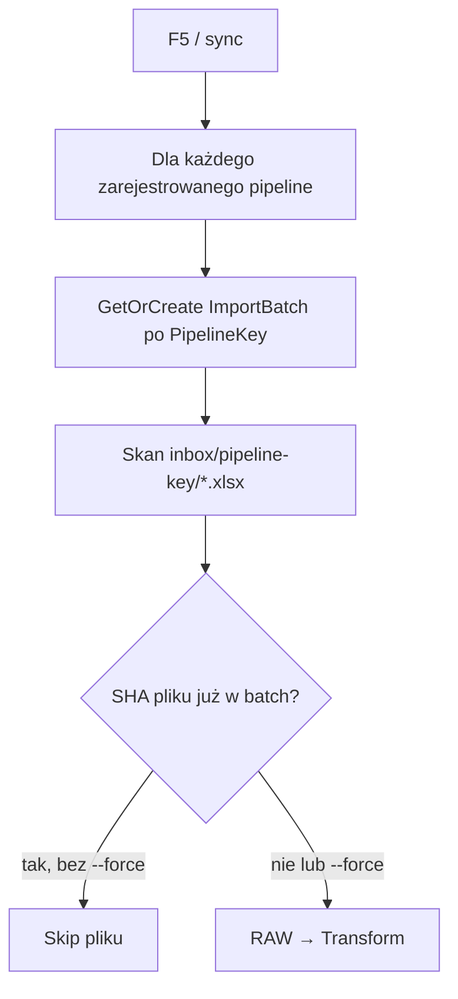

# Przewodnik developera — import

Jedyny entry point na co dzień: **`PoliticalPaths.ImportWorker`** (konsola). **F5** = komenda `sync` — skan inbox, import RAW + transform, synchronicznie.

Szczegóły tabel: **[DATABASE-SCHEMA.md](DATABASE-SCHEMA.md)**. Architektura: [architecture/05-domain-model.md](architecture/05-domain-model.md).

---

## Start od zera — skomplikowany import (`sejm-demo-2023`)

Pełna domena w bazie (wybory, okręgi, listy, kandydatury, mandaty, kluby). Wykonaj **raz** kroki 1–3, potem tylko F5.

### 1. MariaDB

W katalogu repozytorium:

```bash
docker compose up -d
```

Czekaj, aż kontener `politicalpaths-mariadb` jest **healthy** (port `3306`).

### 2. Migracje (wszystkie tabele)

W Visual Studio:

- Startup project: **`PoliticalPaths.ImportWorker`**
- Profil: **`DB migrate`** → uruchom (Ctrl+F5 też wystarczy)

Albo terminal:

```bash
dotnet run --project src/PoliticalPaths.ImportWorker/PoliticalPaths.ImportWorker.csproj --no-launch-profile -- db migrate
```

Powinno wypisać: `Database migrated.`  
Powstają tabele importu **oraz** ~22 tabel domenowych (schemat `app`).

### 3. Import demo

- Upewnij się, że folder **`source-data/inbox/sejm-demo-2023/`** jest **pusty** (bez `.xlsx`) — wtedy F5 sam utworzy `sejm-demo-2023.xlsx` (5 arkuszy).
- Profil: **`Sync pipelines (F5)`**
- **F5**

### 4. Co powinno być w konsoli

```
Repo root: ...
Inbox:     ...\source-data\inbox

Pipeline [test-sample] batch=...
  imported=..., skipped=..., ...

Pipeline [sejm-demo-2023] batch=...
  imported=1, skipped=0, rawRows=..., transformed=..., failed=1
```

(`test-sample` też się odpala — drugi, prostszy pipeline; możesz go zignorować.)

Dla **`sejm-demo-2023`**: `imported=1`, `failed=1` (jeden celowo zły wiersz kandydata), reszta wierszy → tabele domenowe.

### 5. Podgląd w bazie

W kliencie SQL (DBeaver, HeidiSQL, `mysql` CLI) na `localhost:3306`, baza `politicalpaths`, user/hasło z `docker-compose.yml`:

```sql
SELECT NaturalKey, Year, Chamber FROM app.Elections;
-- oczekiwane: sejm-demo-2023

SELECT COUNT(*) AS okregi FROM app.ElectoralDistricts;
SELECT COUNT(*) AS listy FROM app.ElectoralLists;
SELECT COUNT(*) AS kandydatury FROM app.Candidacies;
SELECT COUNT(*) AS mandaty FROM app.Mandates;
-- oczekiwane: 2, 4, 5, 3 (szósty wiersz kandydata = błąd)
```

Więcej zapytań: sekcja [Demo `sejm-demo-2023`](#demo-sejm-demo-2023) poniżej.

### Ponowny import tego samego pliku

Bez zmian w Excelu → przy kolejnym F5: **`skipped=1`** (ten sam SHA — patrz sekcja [SHA](#sha--po-co-hashowanie)).  
Żeby wymusić od nowa: usuń `sejm-demo-2023.xlsx` z inbox i F5 (nowy SHA), albo profil **`Sync — bez seeda`** nie jest potrzebny — użyj argumentu **`sync --force`** w profilu launch (własny profil VS) lub terminala.

---

## Start od zera — skrót (każdy dzień)

| Krok | Akcja |
|------|--------|
| Docker | `docker compose up -d` (jeśli nie działa) |
| VS | Startup: `ImportWorker`, profil **`Sync pipelines (F5)`**, **F5** |

Migrację powtarzasz tylko po `git pull` z nowymi migracjami EF.

---

## SHA — po co hashowanie?

Chodzi o **dwa poziomy**, żeby nie importować tego samego dwa razy.

### SHA pliku (`ImportFile.Sha256`)

Przed importem aplikacja liczy **SHA-256 całego pliku** `.xlsx` i porównuje z tym, co już jest w **`ImportBatch`** (dla danego pipeline).

| Sytuacja | Zachowanie |
|----------|------------|
| Ten sam plik (bit w bit) już w batchu | **Skip** — nie czyta Excela ponownie |
| Nowy plik lub zmieniona zawartość | Nowy hash → **RAW + transform** |
| `sync --force` | Wymusza ponowny import mimo tego samego SHA |

**Po co:** wrzucasz plik do inbox raz; F5 odpala sync codziennie — bez SHA za każdym razem przetwarzałbyś wszystko od zera.

To **nie** szyfrowanie i **nie** kompresja — tylko „odcisk palca” pliku do porównania.

### Hash wiersza (`ImportRow.RowHash`)

Przy RAW każdy wiersz arkusza dostaje hash z **treści kolumn** (po zapisie do `RawPayloadJson`). Ten sam wiersz przy reimport RAW → pomijany.

**Po co:** idempotencja na poziomie wiersza, gdy plik się zmienił tylko częściowo lub robisz `--force` na pliku.

---

## Jak działa `sync` (F5)



- **Jeden `ImportBatch` = jeden pipeline** (np. `sejm-demo-2023`), nie jedno przypadkowe F5 na wszystko.
- **Inbox:** `source-data/inbox/{pipeline-key}/` — jeden podfolder = jeden transformer.
- **Orchestracja:** `ImportSyncService` (synchronicznie, bez kolejki w tle).

### Profile w Visual Studio (`launchSettings.json`)

| Profil | Co robi |
|--------|---------|
| **`Sync pipelines (F5)`** | `sync` — import (domyślny na F5) |
| **`DB migrate`** | `db migrate` — tabele w MariaDB |
| **`Sync — bez seeda`** | `sync --no-seed` — nie tworzy przykładowych Exceli w pustych folderach |

### Inbox

```
source-data/inbox/
  test-sample/        ← prosty demo (błędy walidacji)
  sejm-demo-2023/     ← pełna domena (5 arkuszy)
```

Pusty folder pipeline → przy `sync` (bez `--no-seed`) automatyczny seed `.xlsx`.

Opcjonalnie obok Excela: `plik.import.json` z `"logicalName"` (gdy nazwa pliku ≠ klucz importera).

---

## `ImportJob` i Hangfire — czy potrzebne?

**Na dev: nie.**

| Element | Stan |
|---------|------|
| **Hangfire** | **Nie używamy** — nie ma w projekcie, nie ma schedulera |
| **`ImportJob` (tabela)** | Zostaje w migracji jako **szkielet** pod ewentualny cron w przyszłości |
| **`sync` / F5** | **Nie tworzy** rekordów `ImportJob` — cały import w jednym procesie |

Źródło prawdy „co już zaimportowane” to **`ImportFile`** (SHA) w ramach **`ImportBatch`**, nie `ImportJob`.

Stare wzmianki o Hangfire w ADR/architekturze = plan opcjonalny; **aktualny flow = tylko `ImportSyncService`**.

---

## Dwa pipeline'y demo

| Pipeline | Folder inbox | Co trafia do bazy domenowej |
|----------|--------------|-----------------------------|
| `test-sample` | `inbox/test-sample/` | **Nie** — tylko `ImportRow` + błędy (`DomainEntityType` = placeholder) |
| **`sejm-demo-2023`** | `inbox/sejm-demo-2023/` | **Tak** — `Election`, `Politician`, `Candidacy`, `Mandate`, … |

Oba odpalają się przy jednym F5 (dwa batche, dwa foldery).

---

## Demo `sejm-demo-2023`

Excel z **5 arkuszami** (seed generuje plik, jeśli folder pusty):

| Arkusz | Tabele domenowe |
|--------|-----------------|
| **Okregi** | `Election`, `LegislativeTerm`, `ElectoralDistrict`, `ElectoralDistrictSnapshot`, `TerritorialUnit`, `ElectoralDistrictTerritory` |
| **Listy** | `Party`, `ElectoralCommittee`, `ElectoralList` |
| **Kandydaci** | `Politician`, `Candidacy`, `CandidacyVoteResult`; przy `Wybrany=TAK` → `ElectionMandateAllocation`, `Mandate`, `MandateEvent` |
| **Frekwencja** | `DistrictTurnoutResult` |
| **Kluby** | `ParliamentaryClub`, `ClubMembership` |

Transform sortuje arkusze: Okregi → Listy → Kandydaci → Frekwencja → Kluby, potem agreguje **`ElectoralListVoteResults`**.

Kod: `Importers.Transform/SejmDemo2023/`.

### SQL — podgląd po imporcie

```sql
SELECT NaturalKey, Year, Chamber, Profile FROM app.Elections;

SELECT d.DistrictNumber, d.Name, s.Population, s.SeatsAllocated
FROM app.ElectoralDistricts d
JOIN app.ElectoralDistrictSnapshots s ON s.ElectoralDistrictId = d.Id;

SELECT p.DisplayName, d.DistrictNumber, l.ListNumber, c.ListPosition,
       v.VotesReceived, v.Elected
FROM app.Candidacies c
JOIN app.Politicians p ON p.Id = c.PoliticianId
JOIN app.ElectoralDistricts d ON d.Id = c.ElectoralDistrictId
JOIN app.ElectoralLists l ON l.Id = c.ElectoralListId
LEFT JOIN app.CandidacyVoteResults v ON v.CandidacyId = c.Id
ORDER BY d.DistrictNumber, l.ListNumber, c.ListPosition;

SELECT p.DisplayName, m.ValidFrom, m.Status
FROM app.Mandates m
JOIN app.Politicians p ON p.Id = m.PoliticianId;

SELECT c.Name AS klub, p.DisplayName, cm.ValidFrom
FROM app.ClubMemberships cm
JOIN app.ParliamentaryClubs c ON c.Id = cm.ParliamentaryClubId
JOIN app.Politicians p ON p.Id = cm.PoliticianId;
```

### Błędy wiersza

Jeden wiersz w **Kandydaci** ma puste **Nazwisko** → `TransformationErrors`, `ImportRows.Status = Failed`. Reszta wierszy → `Transformed` + rekordy w domenie.

Logi: konsola + `logs/imports/app-*.log`.

---

## Demo `test-sample` (prosty wzorzec)

Jeden arkusz **Kandydaci** — uczy RAW + transform + logowanie błędów **bez** zapisu do `Politicians` / `Candidacies`.

Szczegóły kodu: `TestSampleTransformer`, `TestSampleRowParser` w `Importers.Transform/TestSample/`.

---

## `RawPayloadJson` (skrót)

To **nie** plik JSON w inbox. Po RAW każdy wiersz Excela jest w bazie jako JSON kolumn w `ImportRow.RawPayloadJson`. Transform **czyta ten zapis**, nie otwiera ponownie `.xlsx`.

Sidecar `*.import.json` obok Excela to tylko metadane (`logicalName`), nie dane kandydatów.

---

## Łańcuch encji importu

```
ImportBatch (PipelineKey)
  └── ImportFile (SHA256, logical name)
        └── ImportRow (RawPayloadJson, RowHash)
              └── TransformationError (opcjonalnie)
```

---

## Nowy pipeline (checklist)

1. Folder `source-data/inbox/{pipeline-key}/`
2. `[RawImporter("pipeline-key", ...)]` w `Importers.Raw`
3. `[ImportTransformer("pipeline-key")]` w `Importers.Transform`
4. Seed w `SampleDataSeeder` (opcjonalnie) dla pustego folderu
5. F5

Wzorzec pełnej domeny: skopiuj `SejmDemo2023/`. Wzorzec prostego: `TestSample/`.

---

## Projekty

```
src/
  PoliticalPaths.ImportWorker      ← F5, sync, db migrate
  PoliticalPaths.Application       ← ImportSyncService, inbox
  PoliticalPaths.Domain            ← encje domeny + import
  PoliticalPaths.Infrastructure    ← EF Core, migracje
  PoliticalPaths.Importers.Raw     ← Excel → ImportRow
  PoliticalPaths.Importers.Transform
  PoliticalPaths.Shared            ← RepoPaths, hash wiersza
```

---

## Powiązane

- [DATABASE-SCHEMA.md](DATABASE-SCHEMA.md)
- [architecture/04-transformers.md](architecture/04-transformers.md)
- [adr/013-batch-per-pipeline-sync.md](adr/013-batch-per-pipeline-sync.md)
