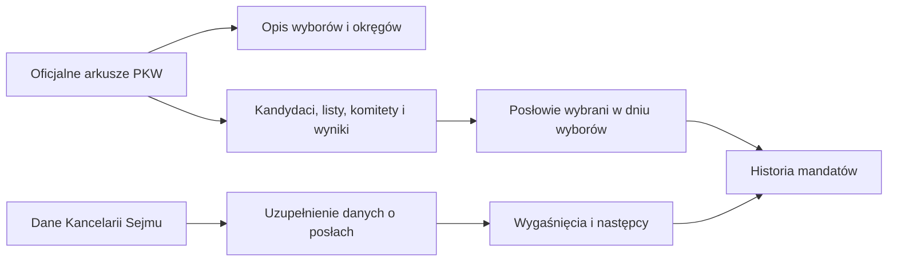

# Import danych o wyborach do Sejmu i mandatach

## Cel dokumentu

Dokument opisuje, jak baza buduje obraz wyborów do Sejmu i późniejszych zmian w składzie izby. Jest przeznaczony dla osób analizujących życie polityczne, wyniki wyborów i kariery posłów — nie wymaga znajomości rozwiązań informatycznych.

Punktem wyjścia są oficjalne dane wyborcze PKW. Są one następnie uzupełniane danymi o składzie Sejmu publikowanymi przez Kancelarię Sejmu. Dzięki temu można rozróżnić: kto kandydował, kto uzyskał mandat w dniu wyborów, kto później zasiadał w Sejmie oraz kto objął mandat po jego wygaśnięciu.

Stan prawny przyjęty w dokumencie: 23 sierpnia 2026 r. Podstawą są Konstytucja RP i obowiązujący tekst jednolity Kodeksu wyborczego, Dz.U. 2025 poz. 365.

## Źródła danych

W jednym imporcie wyborów do Sejmu wykorzystywane są dwa oficjalne pliki PKW.

| Plik | Co zawiera | Co powstaje w bazie |
|---|---|---|
| **Okręgi wyborcze** | Numer okręgu, liczbę mandatów, liczbę mieszkańców i uprawnionych do głosowania, liczbę list oraz kandydatów. | Opis okręgów i ich parametrów dla konkretnych wyborów. |
| **Kandydaci** | Kandydatów, listy i komitety, miejsce na liście, liczbę głosów oraz informację o uzyskaniu mandatu. | Kandydatury, wyniki oraz wskazanie osób wybranych w wyborach. |

Przy każdym zestawie danych zapisywany jest kontekst wyborów: data wyborów, data ich zarządzenia, numer kadencji, organ (Sejm) i rodzaj ordynacji. Obecnie obejmuje to wybory z 2019 r. (IX kadencja) i 2023 r. (X kadencja).

Drugim źródłem są dane Kancelarii Sejmu o posłach danej kadencji. Uzupełniają one informacje biograficzne, kontaktowe, zawodowe oraz informacje o nieaktywnym mandacie.

## Logika importu



### 1. Opis wyborów i okręgów

Najpierw tworzy się opis konkretnych wyborów do Sejmu. Wszystkie dalsze dane — okręgi, listy, kandydatury, głosy i mandaty — są z nim trwale powiązane.

Z pliku o okręgach zapisywane są: numer okręgu, liczba mandatów, liczba mieszkańców, liczba uprawnionych do głosowania, liczba list i liczba kandydatów. Dane pozostają przypisane do roku wyborów, co umożliwia porównywanie tych samych okręgów w kolejnych elekcjach bez nadpisywania historii.

[Art. 96 ust. 1–2 Konstytucji RP](https://isap.sejm.gov.pl/isap.nsf/download.xsp/WDU19970780483/U/D19970483Lj.pdf) stanowi, że Sejm liczy 460 posłów, a wybory są proporcjonalne. [Art. 232 Kodeksu wyborczego](https://isap.sejm.gov.pl/isap.nsf/download.xsp/WDU20250000365/U/D20250365Lj.pdf) wskazuje, że posłowie są wybierani w 41 wielomandatowych okręgach z list kandydatów.

### 2. Kandydaci, listy i wyniki

Każdy kandydat jest łączony z okręgiem, komitetem, listą oraz wynikiem. Przechowywane są między innymi: miejsce na liście, partia i poparcie partyjne, zawód, miejsce zamieszkania, liczba głosów oraz informacja o uzyskaniu mandatu.

Pozwala to analizować relację: **wybory → okręg → komitet i lista → kandydat → wynik**. Możliwe jest zatem badanie indywidualnego poparcia, znaczenia miejsca na liście, konkurencji między listami oraz przebiegu kariery wyborczej tej samej osoby.

[Art. 233 § 1–2 Kodeksu wyborczego](https://isap.sejm.gov.pl/isap.nsf/download.xsp/WDU20250000365/U/D20250365Lj.pdf) określa kolejność obsadzania mandatów według liczby głosów na kandydatów z listy; przy remisie rozstrzyga pozycja na liście. Dlatego zachowywane są oba te elementy.

### 3. Mandaty uzyskane w dniu wyborów

Osoby oznaczone w oficjalnych wynikach jako wybrane otrzymują pierwszy zapis mandatu, powiązany z datą wyborów. Należy odróżniać wynik wyborczy od historii mandatu: wynik mówi, komu przypadł mandat po podziale głosów, natomiast historia mandatu pokazuje późniejsze wygaśnięcie i obsadzenie wolnego miejsca.

[Art. 244–245 Kodeksu wyborczego](https://isap.sejm.gov.pl/isap.nsf/download.xsp/WDU20250000365/U/D20250365Lj.pdf) opisują ustalenie wyników i podział mandatów przez okręgową komisję wyborczą.

### 4. Uzupełnienie informacji o posłach

Dane Kancelarii Sejmu pozwalają uzupełnić: datę i miejsce urodzenia, e-mail, zawód oraz poziom wykształcenia. Gdy kilka osób ma to samo imię i nazwisko, dane nie są automatycznie przypisywane jednej osobie — taki przypadek wymaga weryfikacji badawczej.

Jeżeli dane wskazują nieaktywny mandat, zapisuje się jego wygaśnięcie: zrzeczenie się mandatu, zgon albo inną przyczynę. [Art. 247 § 1–5 Kodeksu wyborczego](https://isap.sejm.gov.pl/isap.nsf/download.xsp/WDU20250000365/U/D20250365Lj.pdf) określa przesłanki i tryb wygaśnięcia mandatu posła. Przy badaniu konkretnego przypadku potwierdzeniem powinno być właściwe postanowienie lub inny dokument urzędowy.

### 5. Następstwo po wygasłym mandacie

Po wygaśnięciu mandatu wyszukiwana jest osoba z tej samej listy i tych samych wyborów, która nie uzyskała mandatu, nie ma go już w tej kadencji i ma najwyższy kolejny wynik głosowania. Przy remisie uwzględniane jest miejsce na liście. Jeżeli taka osoba występuje później w składzie Sejmu, zostaje zapisana jako następca.

Ta reguła odpowiada [art. 251 § 1 Kodeksu wyborczego](https://isap.sejm.gov.pl/isap.nsf/download.xsp/WDU20250000365/U/D20250365Lj.pdf): Marszałek Sejmu, na podstawie informacji PKW, zawiadamia kolejnego kandydata z tej samej listy, który otrzymał kolejno największą liczbę głosów, o przysługującym mu pierwszeństwie do mandatu.

Mechanizm wskazuje prawdopodobny związek między wygasłym mandatem a następcą, lecz nie zastępuje pełnej procedury ustawowej. Dla ustalenia dokładnej daty objęcia mandatu i podstawy prawnej należy sprawdzić dokument urzędowy dotyczący konkretnej sprawy.

## Kontrola jakości przed analizą

Przed wykorzystaniem danych w raporcie warto sprawdzić:

- czy zaimportowano oba pliki PKW: okręgi i kandydatów;
- czy liczba mandatów odpowiada wynikom ogłoszonym dla danych wyborów;
- czy osoby o identycznych imionach i nazwiskach zostały ręcznie rozróżnione;
- czy wygaśnięcia mandatów i następcy są potwierdzone w źródle urzędowym;
- czy data objęcia mandatu przez następcę została potwierdzona poza samym zestawieniem danych.

## Możliwości analityczne

Po imporcie można badać strukturę konkurencji w okręgach, wyniki list i kandydatów, relację miejsca na liście z uzyskaniem mandatu, zmiany afiliacji partyjnych, kariery wyborcze, a także różnicę między składem wybranym w dniu wyborów a składem faktycznie zasiadającym w Sejmie.

<!-- Poniżej znajduje się poprzednia, techniczna wersja dokumentu zachowana wyłącznie w historii roboczej. Nie jest wyświetlana w Markdown.

## Obraz całości

```mermaid
flowchart TD
  A[Arkusze PKW: okręgi i kandydaci] --> B[ImportWorker sync]
  B --> C[ImportSyncService: SHA-256, ImportBatch / ImportFile]
  C --> D[TransformationExecutor]
  D --> E[SejmModernTransformer]
  E --> F[Wybory, okręgi, listy, politycy, starty i wyniki]
  F --> G[MandateGeneratorService]
  G --> H[Mandat + ZdarzenieMandatowe: Wybor]
  I[ImportWorker extend] --> J[SejmApiClient]
  J --> K[API Sejmu: term{n}, term{n}/MP]
  K --> L[SejmDataExtender]
  L --> M[Uzupełnienie danych; wygaśnięcie]
  M --> N[MandatSuccessionResolver]
  N --> O[Mandat + ZdarzenieMandatowe: Wstąpienie]
```

Arkusze PKW są źródłem rozstrzygnięcia wyborów; API Sejmu służy w tym procesie do odtworzenia i uzupełnienia informacji o składzie kadencji. API nie zastępuje formalnego postanowienia Marszałka Sejmu ani informacji PKW.

## 1. Konfiguracja i uruchomienie

`source-data/file-mappings.json` definiuje pipeline `Sejm2023/19`. W aktualnym wpisie są dwa zestawy plików: wybory 2023 (kadencja X) oraz 2019 (kadencja IX). Każdy zestaw zawiera:

- arkusz okręgów (`okregi_*.xlsx`),
- arkusz kandydatów (`kandydaci_*.xlsx`),
- datę wyborów, datę ogłoszenia, turę, organ i numer kadencji.

Import uruchamia się poleceniem:

```powershell
dotnet run --project src/PoliticalPaths.ImportWorker -- sync
```

`ImportSyncService` dla każdego pipeline'u tworzy albo odnajduje `ImportBatch`, wylicza SHA-256 pliku i pomija plik już zaimportowany, chyba że podano `--force`. Następnie `TransformationExecutor` otwiera workbook i wybiera transformer po kluczu `Sejm2023/19`.

Po synchronizacji każdego pipeline'u serwis pobiera wszystkie rekordy `Wybory` i dla każdego uruchamia generowanie mandatów. To oznacza, że utworzenie mandatów jest częścią polecenia `sync`, a nie osobnej komendy.

> **Uwaga implementacyjna:** `SyncFileAsync` buduje ścieżkę z `RepoPaths.InboxDirectory()` i samej nazwy pliku. Aktualny kod nie dokleja klucza pipeline'u, choć opis projektu wskazuje katalog `inbox/{pipeline-key}`. Przed uruchomieniem należy zweryfikować, gdzie faktycznie leżą pliki i czy ścieżka w kodzie odpowiada przyjętej konwencji.

> **Uwaga implementacyjna:** `PipelineContextBuilder` tworzy obecnie kontekst dla każdego wpisu źródłowego, ale w każdym przekazuje całą listę źródeł danego pipeline'u. Dla dwóch wpisów w `file-mappings.json` pełny zestaw plików jest więc przechodzony dwa razy; przy zwykłym uruchomieniu drugi przebieg powinien zostać pominięty po SHA-256. Przy `--force` oba przebiegi są wykonywane ponownie.

## 2. Transformacja PKW — `SejmModernTransformer`

Klasa jest zarejestrowana atrybutem `[ImportTransformer("Sejm2023/19")]`. Tworzy lub odnajduje słownik rodzaju wyborów (`Sejm`) oraz rekord `Wybory`: daty i kadencja pochodzą z manifestu, a ordynacja jest ustawiana na `Proporcjonalna`.

### Podstawa prawna danych wyborczych

- [Art. 96 ust. 1–2 Konstytucji RP](https://isap.sejm.gov.pl/isap.nsf/download.xsp/WDU19970780483/U/D19970483Lj.pdf) stanowi, że Sejm składa się z 460 posłów, a wybory są powszechne, równe, bezpośrednie, proporcjonalne i tajne. Uzasadnia to model wyborów proporcjonalnych, wielomandatowych okręgów i list.
- [Art. 232 Kodeksu wyborczego](https://isap.sejm.gov.pl/isap.nsf/download.xsp/WDU20250000365/U/D20250365Lj.pdf) określa wybór 460 posłów w 41 wielomandatowych okręgach z list kandydatów.
- [Art. 233 § 1–2 Kodeksu wyborczego](https://isap.sejm.gov.pl/isap.nsf/download.xsp/WDU20250000365/U/D20250365Lj.pdf) wiąże obsadzenie mandatów z liczbą głosów oddanych na kandydatów z listy i określa regułę remisu. Te dane są przechowywane jako głosy i pozycja na liście.

### Rozpoznanie rodzaju arkusza

Transformer sprawdza, czy `ImportFile.StoragePath` zawiera znacznik `DISTRICT_FILE_MARKER`:

| Rodzaj pliku | Tworzone lub aktualizowane dane |
|---|---|
| Okręgi | `OkregWyborczy` i `SzczegolyOkregu`: numer, liczba mandatów, mieszkańcy, uprawnieni, liczba list i kandydatów. |
| Kandydaci | `Komitet`, `ListaWyborcza`, `Polityk`, opcjonalna `Partia`, `StartWyborczy` i `WynikiWyborow`. |

W wierszu kandydata transformer odczytuje numer okręgu i listy, pozycję, imię i nazwisko, komitet, przynależność partyjną, poparcie, zawód, miejsce zamieszkania, liczbę głosów i flagę `CzyPrzyznanoMandat`. Nazwy są oczyszczane z opisowych prefiksów, a osoba i pozostałe encje są rozwiązywane przez `IEntityResolver`. Przynależność do partii jest aktualizowana przez `IClubMembershipService`.

Każdy udany wiersz otrzymuje status `Transformed` oraz identyfikator utworzonej encji w `ImportRow`. Błąd pojedynczego wiersza jest zapisany przez `ITransformationErrorRecorder`, a import pozostałych wierszy trwa dalej.

## 3. Generowanie pierwszych mandatów — `MandateGeneratorService`

`GenerateMandatesForElectionAsync(wyboryId)` wyszukuje starty wyborcze danego wyboru, dla których `WynikiWyborow.CzyMandat == true`. Dla każdej osoby, która nie ma już mandatu powiązanego z tymi wyborami, tworzy:

| Rekord | Wartości początkowe |
|---|---|
| `Mandat` | `PolitykId`, `StartWyborczyId`, `DataOd = DataWyborow`, `Status = Aktywny`, `TypObjecia = WyborBezposredni` |
| `ZdarzenieMandatowe` | `Typ = Wybor`, `DataZdarzenia = DataWyborow`, opis „Uzyskanie mandatu w wyniku głosowania” |

Takie odwzorowanie opiera się na wyniku ustalenia podziału mandatów. [Art. 244–245 Kodeksu wyborczego](https://isap.sejm.gov.pl/isap.nsf/download.xsp/WDU20250000365/U/D20250365Lj.pdf) opisuje ustalenie wyników i podział mandatów przez okręgową komisję wyborczą, a art. 233 wskazuje kolejność kandydatów na liście.

`CzyMandat` z arkusza opisuje wynik wyborów. Nie jest sam w sobie dowodem złożenia ślubowania ani całego okresu sprawowania mandatu. Dlatego rekord `Mandat` i `ZdarzenieMandatowe` prowadzą osobną historię.

## 4. Pobranie danych API Sejmu — `SejmApiClient`

Polecenie:

```powershell
dotnet run --project src/PoliticalPaths.ImportWorker -- extend
```

W obecnym kodzie pobiera tylko kadencje 9 i 10. Dla każdej kadencji klient HTTP, z adresem bazowym `https://api.sejm.gov.pl/sejm/`, wywołuje:

| Endpoint | DTO i zastosowanie |
|---|---|
| `term{n}` | `SejmTermResponse`: numer, data `from`, status bieżącej kadencji. |
| `term{n}/MP` | lista `SejmMemberDto`: dane osobowe, kontaktowe, klub, okręg, zawód, wykształcenie i dane o nieaktywności. |

Klient mapuje liczby 1–10 na rzymskie oznaczenia kadencji (`I`–`X`) i zwraca `ExtendSejmMembersDto`. Błąd HTTP powoduje `EnsureSuccessStatusCode()`, a brak deserializowanych danych kończy się wyjątkiem.

## 5. Rozszerzanie bazy — `SejmDataExtender`

`ExtendDataAsync` ładuje wyłącznie wybranych kandydatów Sejmu z odpowiadającej kadencji. Dla ograniczenia zapytania najpierw filtruje nazwiska, a następnie dobiera osobę przez zgodność `FirstName` i `LastName`, bez uwzględnienia innych identyfikatorów.

- Przy jednym dopasowaniu aktualizuje polityka: datę i miejsce urodzenia, e-mail; przy jego starcie: zawód i wykształcenie.
- Przy wielu dopasowaniach nie dokonuje automatycznego wyboru; dopisuje wszystkie możliwe dopasowania do `InformacjeDodatkowe`.
- Przy braku dopasowania nie tworzy rekordu i nie wywołuje sukcesji.

Jeżeli API wskazuje `InactiveCause`, extender oznacza istniejący mandat jako `Wygasniety` oraz, o ile nie istnieje już zdarzenie tego samego typu, tworzy `ZdarzenieMandatowe`. Mapowanie jest następujące: `Zrzeczenie` → `Zrzeczenie`, `Zgon` → `Zgon`, każda pozostała przyczyna → `Wygasniecie`. Zapis zdarzenia uruchamia próbę znalezienia następcy.

### Podstawa prawna wygaśnięcia

[Art. 247 § 1–5 Kodeksu wyborczego](https://isap.sejm.gov.pl/isap.nsf/download.xsp/WDU20250000365/U/D20250365Lj.pdf) określa przesłanki wygaśnięcia mandatu posła i tryb postanowienia Marszałka Sejmu, a także odmowę ślubowania. Kod rejestruje tylko uproszczoną klasyfikację przyczyny przekazaną przez API; nie stanowi samodzielnego ustalenia prawnego wygaśnięcia.

## 6. Sukcesja — `MandatSuccessionResolver`

Po zarejestrowaniu nowego zdarzenia wygaśnięcia resolver:

1. znajduje listę wyborczą, z której startował poprzedni poseł w tej samej kadencji;
2. wyszukuje osoby z tej listy, które nie miały flagi `CzyMandat` i nie mają już mandatu w tej kadencji;
3. sortuje je malejąco po `LiczbaGlosow`, a przy remisie rosnąco po `NumerNaLiscie`;
4. porównuje ich imię i nazwisko z aktualną listą członków API;
5. dla pierwszej znalezionej osoby uzupełnia dane i dodaje mandat typu `Sukcesja` oraz zdarzenie `Wstąpienie`.

Reguła „ta sama lista, kolejno największa liczba głosów” odpowiada [art. 251 § 1 Kodeksu wyborczego](https://isap.sejm.gov.pl/isap.nsf/download.xsp/WDU20250000365/U/D20250365Lj.pdf). W razie równej liczby głosów przepis odsyła do art. 233 § 2, dlatego dodatkowe uporządkowanie po numerze na liście jest właściwym technicznym odwzorowaniem tej zasady. Artykuł 251 obejmuje też zawiadomienie przez Marszałka Sejmu na podstawie informacji PKW, pierwszeństwo do mandatu i dalsze warianty postępowania — aplikacja nie modeluje dziś pełnej procedury tych oświadczeń.

## Różnica między regułą prawną a aktualnym kodem

| Obszar | Reguła prawna / docelowa interpretacja | Aktualne zachowanie |
|---|---|---|
| Źródło sukcesji | Zawiadomienie Marszałka Sejmu na podstawie informacji PKW, zgodnie z art. 251. | API Sejmu jest wskaźnikiem, że kandydat należy do składu; nie zapisuje się dokument źródłowy. |
| Data wygaśnięcia | Powinna wynikać z właściwego zdarzenia lub postanowienia. | Zdarzenie otrzymuje `mandat.DataOd.AddDays(1)`. |
| Data wejścia następcy | Powinna wynikać z formalnego objęcia mandatu. | Ustawiana na `term.From.AddDays(1)`, czyli początek całej kadencji, także dla późniejszej sukcesji. |
| Pierwszeństwo | Kandydat może skorzystać albo nie skorzystać z pierwszeństwa w ustawowym trybie. | Kod wybiera pierwsze dopasowanie obecne w API; nie rejestruje zawiadomienia, odmowy ani terminu. |
| Identyfikacja osoby | Wymaga odpornego identyfikatora lub weryfikacji. | Dokładne porównanie imienia i nazwiska; kolizje trafiają do informacji dodatkowych. |
| Przyczyny wygaśnięcia | Art. 247 zawiera szczegółowy katalog i tryb. | Trzy kategorie: zrzeczenie, zgon i ogólne wygaśnięcie. |

W konsekwencji mechanizm jest użyteczny do zasilania i oznaczania danych, ale wyniki dotyczące dat i podstawy objęcia mandatu wymagają weryfikacji ze źródłem urzędowym przed użyciem jako fakt prawny.

## Kontrole operacyjne

Po `sync` należy sprawdzić `ImportBatch`, `ImportFile`, `ImportRow` i `TransformationErrors`, w szczególności liczbę wierszy z `Failed`. Po `extend` warto zweryfikować:

- mandaty o statusie `Wygasniety` i odpowiadające im `ZdarzeniaMandatowe`,
- mandaty `Sukcesja` wraz z listą, głosami i kolejnością kandydata,
- wpisy `InformacjeDodatkowe` zawierające wiele możliwych dopasowań,
- daty `DataOd`, ponieważ obecny algorytm nie pobiera daty zdarzenia z API.

## Powiązane pliki

- `src/PoliticalPaths.Importers.Transform/Sejm/SejmModernTransformer.cs`
- `src/PoliticalPaths.Application/Imports/ImportSyncService.cs`
- `src/PoliticalPaths.Application/Services/MandateGeneratorService.cs`
- `src/PoliticalPaths.Infrastructure/Sejm/SejmApiClient.cs`
- `src/PoliticalPaths.Infrastructure/Sejm/SejmDataExtender.cs`
- `src/PoliticalPaths.Application/Services/MandatSuccessionResolver.cs`
-->
