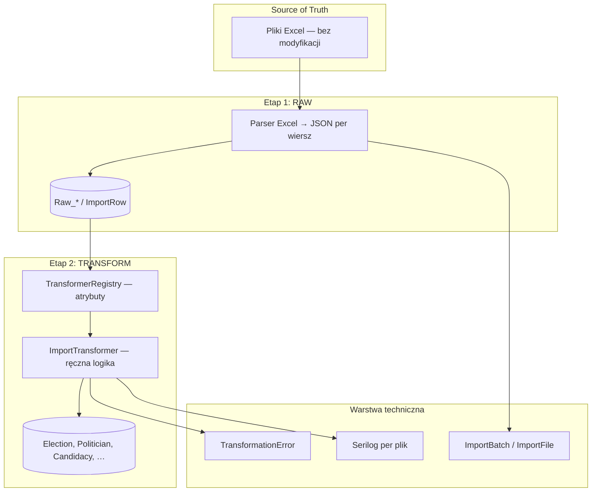

# Przegląd architektury

## Technologie

| Warstwa | Wybór |
|---------|--------|
| Runtime | .NET 8+ (obecny szkielet: net9.0 — do ujednolicenia przy rozdziale solution) |
| ORM | Entity Framework Core |
| Baza | MariaDB |
| Excel (RAW) | ClosedXML (MIT) |
| Logowanie | Serilog (structured, JSON Lines do plików) |
| Orkiestracja jobów | Hangfire + MariaDB (docelowo) |
| API (później) | Minimal API → Hot Chocolate (GraphQL) |

## Architektura modularna

```
source-data (immutable)
    → RAW IMPORT (tabele pośrednie + ImportRow)
    → TRANSFORM (ręczne transformery → model domenowy)
    → zapytania / GraphQL / analityka
```

## Przepływ danych



## Semantyka importu (ważne)

**Import ≠ zasilenie jednej tabeli.**

Typowy przebieg transformacji **jednego wiersza** tabeli z Excela:

1. Odczyt wiersza z `ImportRow` (payload z RAW).
2. **Polityk** — dopasowanie (identity resolution) lub utworzenie nowego `Politician` + ewentualnie `PoliticianAlias`.
3. **Start wyborczy** — utworzenie `Candidacy` (powiązanie: wybory, okręg, lista, pozycja na liście).
4. **Kontekst startu** — partia/komitet, lista, klub (jeśli dotyczy pliku), powiązania z `ElectoralList` / `Party`.
5. **Wyniki** — `VoteResult` lub agregaty (zależnie od pliku).
6. Zapis fingerprintów / `SourceImportRowId` pod idempotency i audyt.
7. Błędy i ostrzeżenia → `TransformationError` (wiersz może przejść dalej w batchu).

Transformery implementują tę logikę **jawnie**, plik po pliku — bez magicznego mapowania kolumn na encje.

## Skalowanie liczby plików

- Setki plików / wiele trybów → **nie** jeden uniwersalny transformer.
- **1 transformer (klasa) = 1 scenariusz biznesowy**, z możliwością przypisania **wielu** plików logicznych przez atrybut (patrz [04-transformers.md](04-transformers.md)).
- RAW może być wspólny (generyczny `ImportRow`) lub dedykowany per rodzina formatów.

## Dokumenty powiązane

- [02-source-data.md](02-source-data.md)
- [03-etl-two-stage.md](03-etl-two-stage.md)
- [04-transformers.md](04-transformers.md)
- [implementation-plan.md](../implementation-plan.md)
