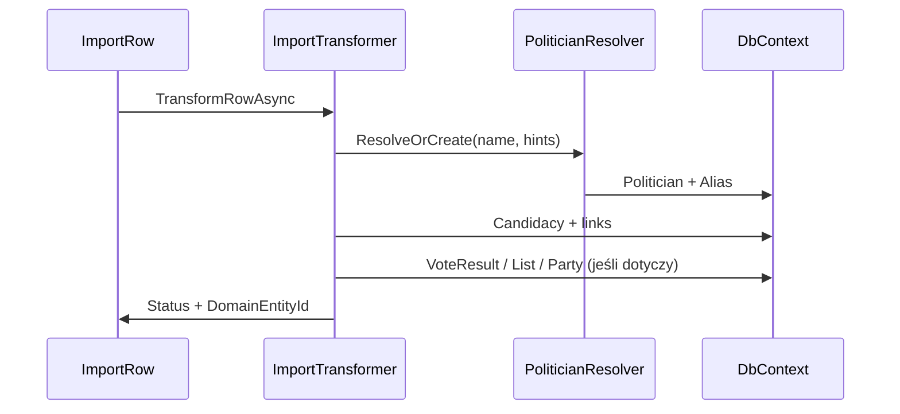

# Transformery — projekt pod ręczną implementację

## Założenia

1. **Transformery piszesz ręcznie** — każdy plik/rodzina danych może mieć inną logikę.
2. **Jeden transformer może obsługiwać wiele plików** (np. Sejm 2019 i Sejm 2023) — wspólna logika, różnice w podklasie lub parametrze `ElectionYear`.
3. **Rejestracja przez atrybut** na klasie — bez ręcznej listy w DI dla setek plików.
4. Import to **proces wiersz po wierszu** budujący graf domenowy, nie bulk insert do jednej tabeli.

## Przepływ transformacji wiersza



### Przykładowa kolejność w kodzie (wewnątrz transformera)

```csharp
public async Task<RowTransformResult> TransformRowAsync(
    ImportRow row,
    TransformContext ctx,
    CancellationToken ct)
{
    var parsed = ParseRow(row); // ręczne mapowanie kolumn z JSON

    var politician = await ctx.PoliticianResolver
        .ResolveOrCreateAsync(parsed.FullName, parsed.BirthDate, ct);

    var election = await ctx.ElectionCatalog
        .GetOrThrowAsync(ctx.ElectionYear, ctx.ElectionType, ct);

    // Okręg: chamber + election (Sejm ≠ Senat ≠ sejmik); patrz 05-domain-model.md
    var district = await ctx.DistrictMapper
        .MapAsync(election.Id, election.Chamber, parsed.DistrictNumber, ct);

    // Lista zawsze w kontekście okręgu
    var list = await ctx.ElectoralListResolver
        .ResolveAsync(election.Id, district.Id, parsed.ListNumber, parsed.CommitteeName, ct);

    var candidacy = await ctx.CandidacyFactory
        .GetOrCreateAsync(politician.Id, election.Id, district.Id, list.Id, parsed, row.Id, ct);

    await ApplyRowSpecificFactsAsync(candidacy, parsed, ct); // wyniki, %, mandat, itd.

    return RowTransformResult.Ok(candidacy.Id);
}
```

Współdzielone kroki (`PoliticianResolver`, `DistrictMapper`) żyją w `Shared` / `Application` — transformer skupia się na **semantyce pliku**.

## Atrybut — wiele plików → jedna klasa

### Definicja atrybutu

```csharp
[AttributeUsage(AttributeTargets.Class, AllowMultiple = false, Inherited = false)]
public sealed class ImportTransformerAttribute : Attribute
{
    /// <summary>
    /// Stabilne nazwy scenariuszy — mapowane z ImportFile.LogicalName.
    /// Jeden transformer może mieć wiele nazw.
    /// </summary>
    public string[] LogicalNames { get; init; } = [];

    /// <summary>
    /// Opcjonalnie: typ źródła ze słownika (dla importera RAW).
    /// </summary>
    public string[]? DataSourceTypes { get; init; }

    /// <summary>
    /// Obsługiwane wersje formatu Excel (v1, v2).
    /// Pusta = wszystkie.
    /// </summary>
    public string[]? FormatVersions { get; init; }

    public int Priority { get; init; } = 0; // wyższy wygrywa przy kolizji
}
```

### Przykłady użycia

**Jeden transformer — wiele logical names (wspólna logika):**

```csharp
[ImportTransformer(
    LogicalNames = [
        "sejm-2019-wyniki-okreg",
        "sejm-2023-wyniki-okreg"
    ],
    FormatVersions = ["v1", "v2"])]
public sealed class SejmDistrictResultsTransformer : IImportTransformer
{
    // ElectionYear z ImportFile / TransformContext
}
```

**Osobny transformer per plik (gdy logika się rozjeżdża):**

```csharp
[ImportTransformer(LogicalNames = ["senat-2023-listy-single-mandate"])]
public sealed class Senat2023SingleMandateListsTransformer : IImportTransformer
```

**Wariant z podklasą (różnice minimalne):**

```csharp
[ImportTransformer(LogicalNames = ["sejm-2019-listy"])]
public class Sejm2019CandidateListsTransformer : SejmCandidateListsTransformerBase { }

[ImportTransformer(LogicalNames = ["sejm-2023-listy"])]
public class Sejm2023CandidateListsTransformer : SejmCandidateListsTransformerBase
{
    protected override void MapListColumns(RowParseResult row) { /* v2 columns */ }
}
```

## Rejestr — skan atrybutów

```csharp
public interface IImportTransformerRegistry
{
    IImportTransformer Resolve(string logicalName, string? formatVersion = null);
    IReadOnlyList<TransformerRegistration> GetAll();
}

public sealed record TransformerRegistration(
    string LogicalName,
    Type TransformerType,
    int Priority);
```

**Budowa przy starcie aplikacji:**

1. Skan assembly `PoliticalPaths.Importers.Transform` (Scrutor lub refleksja).
2. Znajdź klasy z `[ImportTransformer]` implementujące `IImportTransformer`.
3. Dla każdego `LogicalName` w atrybucie → wpis w słowniku.
4. Kolizja (dwa transformery, ten sam name) → **fail fast** przy starcie + log.
5. `FormatVersion` — jeśli podany w `ImportFile`, filtruj; inaczej użyj wpisu z `Priority`.

### DI

```csharp
// Transformer rejestrowany jako konkretny typ, resolve przez factory:
services.AddScoped<SejmDistrictResultsTransformer>();
services.AddScoped<IImportTransformerRegistry, AttributeBasedTransformerRegistry>();
services.AddScoped<IImportTransformer>(sp =>
{
    var logicalName = sp.GetRequiredService<IImportExecutionContext>().LogicalName;
    return sp.GetRequiredService<IImportTransformerRegistry>().Resolve(logicalName);
});
```

## Importer RAW vs Transformer

| Interfejs | Odpowiedzialność |
|-----------|------------------|
| `IRawExcelImporter` | Excel → `ImportRow` (może też mieć atrybut `[RawImporter(LogicalNames = …)]`) |
| `IImportTransformer` | `ImportRow` → model domenowy |

Dla bardzo różnych plików możesz mieć **osobny** RAW importer i transformer, albo jeden logical name łączący oba przez ten sam atrybut (osobne atrybuty zalecane dla czytelności).

## Kontrakt `IImportTransformer`

```csharp
public interface IImportTransformer
{
    /// <summary>
    /// Przetwarza wszystkie wiersze pliku (batchami wewnętrznie).
    /// </summary>
    Task<TransformFileResult> TransformFileAsync(
        ImportFile file,
        IReadOnlyList<ImportRow> rows,
        TransformContext ctx,
        CancellationToken ct);
}
```

Implementacja może delegować do `TransformRowAsync` w pętli — ułatwia testy jednostkowe per wiersz.

## `TransformContext` (współdzielone serwisy)

| Serwis | Rola |
|--------|------|
| `IPoliticianResolver` | identity + tworzenie |
| `IElectoralDistrictMapper` | numer okręgu + chamber + election → `ElectoralDistrict` (+ TERYT, snapshoty) |
| `IElectoralListResolver` | lista w **konkretnym** okręgu |
| `ITerytMapper` | jednostki terytorialne |
| `IElectoralListResolver` | listy / komitety |
| `ICandidacyFactory` | idempotentne starty |
| `IManualMappingStore` | ręczne mapowania z DB |
| `IImportRowLogger` | log per wiersz z `ImportRowId` |

## Błędy

- `TransformationError`: `StepName`, `ErrorCode`, `Severity`, `FieldName`, `RawValue`.
- Warning → kontynuuj; Error → `ImportRow.Failed` (domyślnie).
- `NeedsManualReview` — np. identity score w strefie niepewności.

## Antywzorce (unikaj)

- Automatyczne mapowanie wszystkich kolumn Excel → encje EF.
- Jeden gigantyczny `switch` po nazwie pliku w orchestratorze.
- Nadpisywanie `Politician` przy każdym imporcie zamiast `Candidacy` + aliasów.

## Powiązane

- [05-domain-model.md](05-domain-model.md) — identity polityków
- [03-etl-two-stage.md](03-etl-two-stage.md) — RAW i replay
