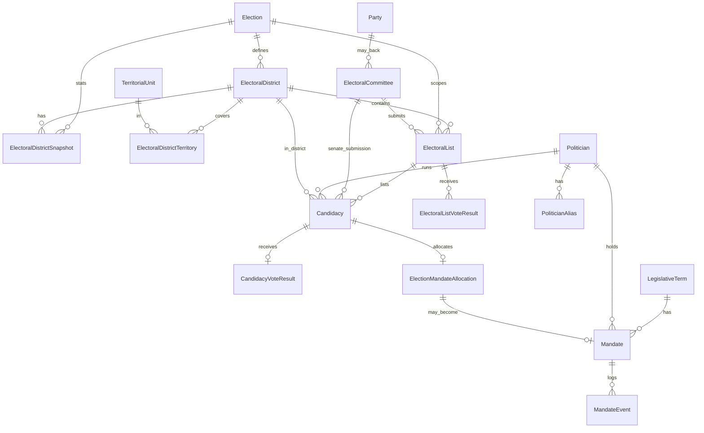

# Model domenowy

> Uzupełnij po udostępnieniu schematu ERD (`Bez tytulu.jpg`). Poniżej model docelowy — w tym **okręgi**, **TERYT**, **wersjonowanie statystyk okręgu** i **kontekst wyborów**.

**Walidacja względem Kodeksu wyborczego:** [09-domain-model-validation-kw.md](09-domain-model-validation-kw.md) (2026-05-20).

## Zasada nadrzędna: kontekst wyborów

Prawie wszystko, co zależy od roku lub typu wyborów, jest powiązane z **`Election`** (konkretne wybory: Sejm 2023, Senat 2019, sejmik 2024, …).

| Nie rób tak | Rób tak |
|-------------|---------|
| Jedna globalna tabela „okręgów” | Okręg **w ramach** typu izby + konkretnych wyborów |
| Jedna liczba mieszkańców na okręg | **Snapshot** statystyk per wybory / data obowiązywania |
| „Aktualny” wynik na okręgu | `VoteResult` zawsze z `ElectionId` |
| Lista bez okręgu | `ElectoralList` → `ElectoralDistrict` → `Election` |
| Senat = lista obowiązkowa | W Senacie **brak list** — `Candidacy` bez `ElectoralListId` (patrz walidacja KW) |
| Komitet = partia | Listę zgłasza **komitet wyborczy** — encja `ElectoralCommittee`, nie tylko `Party` |

### Okręg wyborczy ≠ obwód wyborczy

| Pojęcie | Poziom | W modelu (faza 1) |
|---------|--------|-------------------|
| **Okręg wyborczy** | Dzieli kraj/województwo na mandaty (41 Sejm, 100 Senat, …) | `ElectoralDistrict` |
| **Obwód wyborczy** | Miejsce głosowania (szkoła) | Poza zakresem, chyba że importujesz protokoły obwodowe |

---

## Typy okręgów (osobne światy)

Okręgi **Sejmu**, **Senatu** i **sejmików województw** to **różne zbiory** — inna numeracja, inne granice, inna semantyka. W modelu nie wolno ich mieszać w jednym rekordzie bez rozróżnienia typu.

```csharp
public enum ElectoralChamber
{
    Sejm,
    Senate,
    RegionalAssembly   // sejmik województwa
}
```

`ElectoralDistrict` niesie `ElectoralChamber` + powiązanie z `Election` (patrz niżej).

---

## Geografia — TERYT

### `TerritorialUnit`

Jednostka administracyjna identyfikowana kodem **TERYT** (słownik referencyjny).

| Pole | Opis |
|------|------|
| `TerytCode` | np. 7/9 cyfr — UNIQUE w wersji |
| `Name` | nazwa |
| `Level` | `Voivodeship` \| `Powiat` \| `Gmina` \| `City` \| … |
| `ParentTerytCode` | hierarchia |
| `ValidFrom` / `ValidTo` | TERYT i granice **zmieniają się w czasie** |

### Powiązanie okręg ↔ TERYT

Okręg nie „jest” jednym kodem TERYT — **obejmuje** obszar złożony z jednostek (województwo, powiat, miasto). Relacja **M:N**:

```
ElectoralDistrictTerritory
  ElectoralDistrictId
  TerritorialUnitId
  CoverageType?   -- np. Primary | Partial | Excluded
```

W transformatorze: mapowanie z pliku (nazwa / kod / poziom) → `TerritorialUnit` + ewentualnie `ManualMapping` gdy PKW podaje inny zapis niż słownik.

**Poseł / kandydat startuje w okręgu wyborczym** — `Candidacy.ElectoralDistrictId` wskazuje ten okręg (w kontekście danych `Election`), nie pojedynczy TERYT. TERYT służy do analizy geograficznej i map.

---

## Okręg wyborczy — `ElectoralDistrict`

### Tożsamość okręgu

Okręg jest zdefiniowany **dla konkretnych wyborów** (lub wspólnego „wydania” granic powiązanego z `Election`):

```csharp
public class ElectoralDistrict
{
    public Guid Id { get; set; }
    public Guid ElectionId { get; set; }           // Sejm 2023, Senat 2019, …
    public ElectoralChamber Chamber { get; set; }
    public int DistrictNumber { get; set; }        // numer z PKW w tych wyborach
    public string? Name { get; set; }             // nazwa opisowa z danych
    public string NaturalKey { get; set; }         // hash/Chamber+ElectionId+Number — UNIQUE
}
```

**Dlaczego per `Election`?**  
Numer i zasięg okręgu **19** w Sejmie 2019 ≠ okręg **19** w Sejmie 2023. Senat ma inne okręgi niż Sejm. Sejmik ma własne okręgi w skali województwa.

Opcjonalnie (później): `DistrictDefinition` współdzielone między wyborami tego samego typu, jeśli PKW publikuje stabilne ID — na start wystarczy `ElectionId` + numer.

### Statystyki okręgu — wersjonowanie

Liczba mieszkańców, uprawnionych, wyborców, frekwencja bazowa — **różni się między wyborami**. Nie aktualizuj kolumny na `ElectoralDistrict`.

```csharp
public class ElectoralDistrictSnapshot
{
    public Guid Id { get; set; }
    public Guid ElectoralDistrictId { get; set; }
    public Guid ElectionId { get; set; }          // redundantnie dla zapytań; spójne z okręgiem

    public int? Population { get; set; }            // ludność — norma mandatów (art. 202 KW)
    public int? EligibleVoters { get; set; }      // wyborcy uprawnieni (protokoły PKW)
    public int? RegisteredVoters { get; set; }    // jeśli w danych
    public int? SeatsAllocated { get; set; }      // liczba mandatów w okręgu (załącznik KW)
    public DateOnly? StatisticsDate { get; set; } // data stanu z pliku PKW
    public string? SourceImportRowId { get; set; }

    public DateTime CreatedAt { get; set; }
}
```

| Zdarzenie | Akcja |
|-----------|--------|
| Import wyników Sejm 2019 | `Snapshot` dla okręgów wyborów 2019 |
| Import Sejm 2023 | **nowe** snapshoty, stare zostają |
| Reimport 2019 | nowy batch → nowe snapshoty lub idempotentny upsert po `(DistrictId, ElectionId, StatisticsDate)` |

**Zapytanie:** „ile uprawnionych miał okręg 12 w 2019?” → join `ElectoralDistrict` + `ElectoralDistrictSnapshot` WHERE `Election.Year = 2019`.

---

## Wybory — `Election`

```csharp
public class Election
{
    public Guid Id { get; set; }
    public int Year { get; set; }
    public ElectoralChamber Chamber { get; set; }
    public ElectionScope Scope { get; set; }     // National | Voivodeship | …
    public Guid? VoivodeshipTerritorialUnitId { get; set; }  // dla sejmiku
    public DateOnly? ElectionDate { get; set; }
    public string NaturalKey { get; set; }       // np. sejm-2023, senat-2019, sejmik-2024-mazowieckie
}
```

Jeden rekord `Election` = jeden przebieg wyborów danego typu (ew. z województwem dla sejmiku).

### Profil wyborów (`ElectionProfile`)

Różne typy wyborów mają **inny kształt** `Candidacy` — waliduj w aplikacji, nie jednym sztywnym FK.

| Profil | Chamber / Scope | Okręg | Lista | Komitet |
|--------|-----------------|-------|-------|---------|
| `SejmProportional` | Sejm, kraj | tak | **tak** | tak |
| `SenateMajoritarian` | Senat, kraj | tak | **nie** | tak (zgłaszający) |
| `RegionalAssemblyProportional` | sejmik, województwo | tak | tak | tak |
| `Presidential` | — | nie | nie (lista krajowa PKW) | inna ścieżka |
| `EuropeanParliament` | (później) | tak | tak | tak |

---

## Komitet wyborczy — `ElectoralCommittee`

W KW kandydata/listę zgłasza **komitet wyborczy** (partia, koalicyjny, itd.) — art. 96–99, 209.

```csharp
public class ElectoralCommittee
{
    public Guid Id { get; set; }
    public Guid ElectionId { get; set; }
    public string Name { get; set; } = null!;
    public string? ShortName { get; set; }          // skrót na karcie do głosowania
    public ElectoralCommitteeType Type { get; set; } // Party | Coalition | VotersCommittee | …
    public Guid? PartyId { get; set; }              // opcjonalnie, gdy komitet = partia
}
```

`Party` to podmiot polityczny; `ElectoralCommittee` to byt **epizodyczny na dane wybory** (może łączyć wiele partii w koalicji).

---

## Listy wyborcze w okręgu — `ElectoralList`

Dotyczy profilu **listowego** (Sejm, sejmik). W **Senacie encja nie występuje** (wybór bezpośredni na kandydata).

```csharp
public class ElectoralList
{
    public Guid Id { get; set; }
    public Guid ElectionId { get; set; }
    public Guid ElectoralDistrictId { get; set; }   // wymagane
    public Guid ElectoralCommitteeId { get; set; }  // kto zgłosił listę
    public int ListNumber { get; set; }             // numer na karcie w okręgu
    public Guid? PartyId { get; set; }              // denormalizacja / szybkie filtry
    public string NaturalKey { get; set; }          // ElectionId + DistrictId + ListNumber
}
```

Zasady KW (Sejm): w okręgu **jedna lista** danego komitetu; kandydat na **jednej** liście w **jednym** okręgu.

Relacje:

```
Election 1──* ElectoralDistrict 1──* ElectoralList
ElectoralCommittee 1──* ElectoralList
```

---

## Start polityka — `Candidacy`

Wspólna encja z **profilami** — pola zależą od typu wyborów.

```csharp
public class Candidacy
{
    public Guid Id { get; set; }
    public Guid PoliticianId { get; set; }
    public Guid ElectionId { get; set; }
    public ElectionProfile Profile { get; set; }

    public Guid? ElectoralDistrictId { get; set; }   // wymagane: Sejm, Senat, sejmik
    public Guid? ElectoralListId { get; set; }       // wymagane: Sejm, sejmik; NULL: Senat
    public Guid? ElectoralCommitteeId { get; set; }  // wymagane: Senat; na liście — z listy
    public int? ListPosition { get; set; }          // pozycja na liście (Sejm / sejmik)

    public string SourceFingerprint { get; set; }   // UNIQUE — skład zależny od Profile
    public long? SourceImportRowId { get; set; }
}
```

| Profil | `SourceFingerprint` zawiera |
|--------|----------------------------|
| Sejm / sejmik | `ElectionId`, `PoliticianId`, `DistrictId`, `ListId`, `ListPosition?` |
| Senat | `ElectionId`, `PoliticianId`, `DistrictId`, `CommitteeId` |

**Reguły KW:** zakaz równoczesnego kandydowania na posła i senatora w tych samych wyborach parlamentarnych — walidacja w transformatorze / `ICandidacyRules`.

Transformer (Sejm): `District` → `List` → `Candidacy` → wyniki.  
Transformer (Senat): `District` → `Committee` → `Candidacy` (bez listy) → wyniki.

---

## Wyniki głosowania — `VoteResult`

Wyniki **zależą od roku / wyborów** — zawsze w kontekście `ElectionId`. Inne kolumny w plikach PKW = inne pola lub osobne typy wyniku, nie nadpisanie.

### Wynik kandydata (najczęstszy przy imporcie list)

```csharp
public class CandidacyVoteResult
{
    public Guid Id { get; set; }
    public Guid CandidacyId { get; set; }
    public Guid ElectionId { get; set; }
    public Guid ElectoralDistrictId { get; set; }

    public int? VotesReceived { get; set; }         // głosy (w tym preferencyjne na liście — art. 227)
    public int? PreferentialVotes { get; set; }   // jeśli plik PKW rozdziela
    public decimal? VotePercent { get; set; }
    public bool? Elected { get; set; }            // wynik wyborów (alokacja), NIE pełnienie mandatu w kadencji
    public long? SourceImportRowId { get; set; }
}
```

> **Uwaga:** `Elected` = rozstrzygnięcie z danego dnia wyborów. Kto **faktycznie** był posłem/senatorem/radnym w 2022 — patrz **`Mandate`** ([10-mandate-lifecycle.md](10-mandate-lifecycle.md)).

### Wynik listy w okręgu (agregat) — tylko profil listowy

```csharp
public class ElectoralListVoteResult
{
    public Guid Id { get; set; }
    public Guid ElectoralListId { get; set; }
    public Guid ElectionId { get; set; }
    public Guid ElectoralDistrictId { get; set; }
    public int? VotesReceived { get; set; }
    public decimal? VotePercent { get; set; }
    public int? SeatsWon { get; set; }
}
```

### Wynik całego okręgu (frekwencja, sumy)

Może iść do `ElectoralDistrictSnapshot` (statystyki przed/po) lub `DistrictTurnoutResult` — zależnie od pliku. Nie mieszaj frekwencji okręgu z głosami na kandydata w jednym wierszu bez typu.

---

## Mandat i kadencja (pełnienie urzędu)

Wyniki wyborów nie wystarczą, gdy mandat **wygasa** (art. 247 KW — poseł; art. 383 — radny) lub jest **obsadzany** ponownie (art. 251 — kolejny z listy; art. 283 — wybory uzupełniające do Senatu).

| Encja | Rola |
|-------|------|
| `LegislativeTerm` | Kadencja organu (Sejm X, Senat X, sejmik woj. Y) |
| `ElectionMandateAllocation` | Kto dostał mandat w podziale po wyborach (jeszcze nie wiadomo, czy objął) |
| `Mandate` | Faktyczne pełnienie: `Politician` + `ValidFrom`/`ValidTo` + przyczyna zakończenia |
| `MandateEvent` | Audyt: ślubowanie, wygaśnięcie, zawiadomienie następcy, wybory uzupełniające |
| `Mandate.PredecessorMandateId` | Łańcuch sukcesji w tym samym „miejscu” (lista / okręg) |

Szczegóły, enumy, indeksy, źródła importu: **[10-mandate-lifecycle.md](10-mandate-lifecycle.md)**.

```csharp
// Skrót — pełna definicja w 10-mandate-lifecycle.md
public class Mandate
{
    public Guid LegislativeTermId { get; set; }
    public Guid PoliticianId { get; set; }
    public CollegialBodyType Body { get; set; }
    public Guid? ElectoralDistrictId { get; set; }
    public Guid? ElectoralListId { get; set; }
    public MandateAcquisitionType AcquisitionType { get; set; }
    public DateOnly ValidFrom { get; set; }
    public DateOnly? ValidTo { get; set; }
    public MandateTerminationReason? TerminationReason { get; set; }
    public Guid? PredecessorMandateId { get; set; }
}
```

---

## Diagram relacji (rozszerzony)



---

## Warstwy tabel

| Warstwa | Przykłady |
|---------|-----------|
| Techniczna importu | `ImportBatch`, `ImportFile`, `ImportRow`, `TransformationError` |
| Referencja TERYT | `TerritorialUnit`, `ManualTerritoryMapping` |
| Wybory i okręgi | `Election`, `ElectoralDistrict`, `ElectoralDistrictSnapshot`, `ElectoralDistrictTerritory` |
| Komitety i listy | `ElectoralCommittee`, `ElectoralList`, `Party` |
| Starty | `Candidacy` (profil zależny od wyborów) |
| Wyniki wyborów | `CandidacyVoteResult`, `ElectoralListVoteResult`, `ElectionMandateAllocation` |
| Kadencja / mandat | `LegislativeTerm`, `Mandate`, `MandateEvent` |
| Polityk | `Politician`, `PoliticianAlias`, `PartyAffiliation`, `ClubMembership` |

---

## Identity resolution (polityk)

Bez zmian względem wcześniejszej wersji — patrz sekcja poniżej.

1. **Manual override** → `PoliticianMergeOverride`
2. **Twarde ID** (PKW, jeśli jest)
3. **BirthDate + NormalizedName**
4. **Fuzzy** → `NeedsManualReview`

Zmiana nazwiska → `PoliticianAlias`. Partia w czasie → `PartyAffiliation` z `[ValidFrom, ValidTo)`.

---

## Indeksy (zalecane)

```sql
UNIQUE (ElectoralDistrict.NaturalKey)
UNIQUE (ElectoralList.NaturalKey)
UNIQUE (Candidacy.SourceFingerprint)
UNIQUE (ElectoralDistrictSnapshot.ElectoralDistrictId, ElectionId, StatisticsDate)

INDEX (ElectoralDistrict.ElectionId, Chamber, DistrictNumber)
INDEX (ElectoralList.ElectoralDistrictId, ListNumber)
INDEX (Candidacy.PoliticianId, ElectionId)
INDEX (CandidacyVoteResult.ElectionId, ElectoralDistrictId)
INDEX (ElectoralDistrictTerritory.TerritorialUnitId)
INDEX (TerritorialUnit.TerytCode, ValidFrom)
```

---

## Checklist normalizacji

- [x] Okręgi Sejm / Senat / sejmik — rozdzielone (`ElectoralChamber` + osobne `Election`)
- [x] Okręg per wybory, nie globalny numer
- [x] TERYT — hierarchia + M:N z okręgiem
- [x] Mieszkańcy / uprawnieni — `ElectoralDistrictSnapshot`, nie kolumna na okręgu
- [x] Lista w okręgu — `ElectoralList` tylko Sejm / sejmik; Senat bez list
- [x] Komitet wyborczy — `ElectoralCommittee` oddzielnie od `Party`
- [x] Start — `Candidacy` z okręgiem; lista tylko w profilu listowym
- [x] Mandaty w okręgu — `ElectoralDistrictSnapshot.SeatsAllocated`
- [x] Wyniki — osobne encje, zawsze `ElectionId`; inne lata = inne rekordy
- [x] Walidacja KW — [09-domain-model-validation-kw.md](09-domain-model-validation-kw.md)
- [ ] Reimport — fingerprint + `SourceImportRowId`; nie kasować historii snapshotów bez polityki
- [ ] Wybory prezydenckie / euro — osobny profil `Election` (poza pierwszą iteracją)
- [x] Mandat dynamiczny — `Mandate` + kadencja ([10-mandate-lifecycle.md](10-mandate-lifecycle.md))

---

## Implikacje dla transformerów

| Krok | Encje |
|------|--------|
| Ustal kontekst | `Election` (rok + chamber + scope) |
| Okręg | `ElectoralDistrict` + `ElectoralDistrictTerritory` + opcjonalnie `Snapshot` |
| Lista (jeśli profil listowy) | `ElectoralList` w tym okręgu |
| Komitet | `ElectoralCommittee` |
| Polityk | `Politician` / resolver |
| Start | `Candidacy` (zgodnie z `ElectionProfile`) |
| Wyniki | `CandidacyVoteResult` / opcjonalnie `ElectoralListVoteResult` / snapshot |

Błędy typowe: `DISTRICT_NOT_FOUND`, `LIST_NOT_IN_DISTRICT`, `CHAMBER_MISMATCH`, `LIST_REQUIRED_FOR_PROFILE`, `LIST_FORBIDDEN_FOR_SENATE`, `DUAL_CHAMBER_CANDIDACY`.

---

## Schemat bazy (MariaDB)

- `app` — domena + import
- `raw` — opcjonalne `Raw_*`

EF Core: FK `Candidacy` → `Election`; opcjonalne FK do `ElectoralDistrict`, `ElectoralList`, `ElectoralCommittee` — ograniczenia CHECK / walidacja aplikacyjna per `ElectionProfile`.
