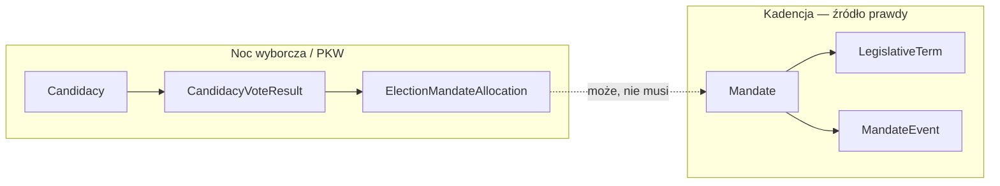
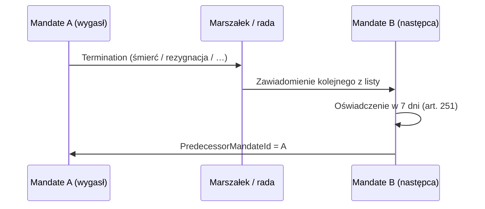
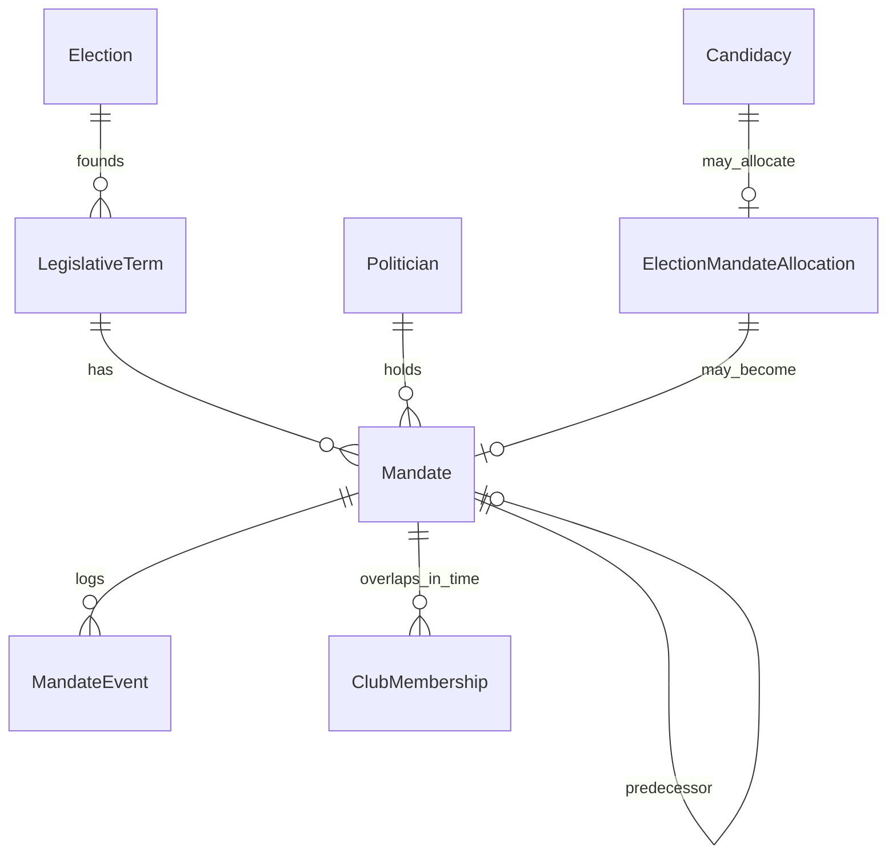

# Mandat i kadencja — dynamiczny skład organów

## Problem

**Wynik wyborów ≠ kto faktycznie piastował mandat w kadencji.**

| Źródło danych | Co wiemy | Czego nie wiemy |
|---------------|----------|-----------------|
| `CandidacyVoteResult.Elected = true` | Przydział mandatu po podziale głosów (Sejm) lub zwycięstwo w okręgu (Senat) | Czy złożył ślubowanie, czy mandat wygasł, kto go **zastąpił** |
| Protokół PKW z dnia wyborów | Głosy, pierwsze rozstrzygnięcie | Skład Sejmu/Senatu/sejmiku **miesiąc / rok później** |
| Klub poselski | Członkostwo w klubie | Kiedy dokładnie wygasł mandat (bywa opóźnione w danych) |

Dlatego potrzebujemy warstwy **mandatu** (tenure) niezależnej od **kampanii wyborczej** (`Candidacy`) i **alokacji z wyborów** (`ElectionMandateAllocation`).

**Podstawa prawna (skrót):** KW rozdz. 9 (art. 247–251) — Sejm; art. 283 — wybory uzupełniające do Senatu; art. 383, 468+ — radni / sejmiki (wygaśnięcie + uzupełnienie analogicznie do art. 251).

---

## Trzy warstwy (nie mylić)



| Warstwa | Encja | Znaczenie |
|---------|--------|-----------|
| **Kampania** | `Candidacy`, `CandidacyVoteResult` | Kto startował i ile głosów; `Elected` = wynik liczenia mandatów **w tych wyborach** |
| **Alokacja** | `ElectionMandateAllocation` | Kto **przysługuje** mandat po podziale (art. 233 — kolejność na liście); jeszcze nie wiadomo, czy objął urząd |
| **Pełnienie** | `Mandate` | Kto **faktycznie** sprawował mandat, od–do, z powodem zakończenia |
| **Kadencja** | `LegislativeTerm` | Ramy czasowe organu (10. kadencja Sejmu, sejmik 2024–2028, …) |

**Zapytanie „kto był posłem z okręgu 19 w 2022?”** → `Mandate` WHERE `Body = Sejm` AND `District` AND `ValidFrom <= 2022 <= ValidTo`, **nie** `CandidacyVoteResult.Elected`.

---

## `LegislativeTerm` (kadencja)

Jeden organ kolacyjny w jednym cyklu konstytucyjnym.

```csharp
public class LegislativeTerm
{
    public Guid Id { get; set; }
    public CollegialBodyType Body { get; set; }      // Sejm | Senate | RegionalAssembly
    public int TermNumber { get; set; }              // np. 10 — kadencja Sejmu RP
    public DateOnly? ConstituentSessionDate { get; set; }  // pierwsze posiedzenie (jeśli znane)
    public DateOnly? DissolvedOn { get; set; }       // koniec kadencji (rozwiązanie / upływ)
    public Guid FoundingElectionId { get; set; }   // wybory, które rozpoczęły kadencję
    public Guid? VoivodeshipTerritorialUnitId { get; set; }  // sejmik — województwo
}
```

**Uwaga:** Wybory parlamentarne 2023 tworzą **dwie** kadencje równolegle: `LegislativeTerm` dla Sejmu i dla Senatu (ten sam `TermNumber` w praktyce, osobne `Id`).

`NaturalKey`: `sejm-term-10`, `senat-term-10`, `sejmik-mazowieckie-2024`.

---

## `Mandate` — pełnienie mandatu

Jeden ciągły okres sprawowania mandatu przez jednego polityka w danej kadencji.

```csharp
public class Mandate
{
    public Guid Id { get; set; }
    public Guid LegislativeTermId { get; set; }
    public Guid PoliticianId { get; set; }
    public CollegialBodyType Body { get; set; }

    public Guid? ElectoralDistrictId { get; set; }   // okręg (Sejm, Senat, sejmik)
    public Guid? ElectoralListId { get; set; }       // Sejm / sejmik — do sukcesji z listy
    public Guid? ElectoralCommitteeId { get; set; }

    public Guid? OriginatingCandidacyId { get; set; }
    public Guid? OriginatingElectionId { get; set; }  // wybory pierwotne lub uzupełniające

    public MandateAcquisitionType AcquisitionType { get; set; }
    public MandateStatus Status { get; set; }
    public DateOnly ValidFrom { get; set; }          // obsadzenie / ślubowanie
    public DateOnly? ValidTo { get; set; }           // wygaśnięcie; NULL = trwa (w archiwum: zamknięta kadencja)

    public MandateTerminationReason? TerminationReason { get; set; }
    public string? TerminationNote { get; set; }     // np. nr postanowienia Marszałka / uchwały rady

    public Guid? PredecessorMandateId { get; set; }  // łańcuch sukcesji w tym „miejscu”
    public int? SuccessorPriorityOnList { get; set; } // kolejność art. 233 przy wejściu z listy
}
```

### `MandateAcquisitionType`

| Wartość | Kiedy (KW / praktyka) |
|---------|------------------------|
| `InitialElection` | Pierwsze objęcie po wyborach powszechnych (po alokacji + ślubowaniu) |
| `SubstituteFromList` | Obsadzenie wolnego mandatu — kolejny z listy (art. 251, 233) |
| `SupplementaryElection` | Wybory uzupełniające (Senat art. 283; Sejm rzadziej) |
| `Other` | Ręczne / źródło historyczne |

### `MandateStatus`

| Wartość | Znaczenie |
|---------|-----------|
| `Active` | Mandat trwa (`ValidTo` NULL) |
| `Terminated` | Wygasł (art. 247 / 383) |
| `NeverAssumed` | Przysługiwał z alokacji, ale nie objął (brak ślubowania / odmowa) |
| `RenouncedBeforeStart` | Zrzeczenie przed objęciem (art. 251 — brak oświadczenia w 7 dni) |

### `MandateTerminationReason` (mapowanie art. 247 § 1 — poseł)

| Wartość | Art. KW (poseł) |
|---------|-----------------|
| `Death` | §1 pkt 1 |
| `LossOfEligibility` | §1 pkt 2 |
| `TribunalStrippedMandate` | §1 pkt 3 |
| `Resignation` | §1 pkt 4 (zrzeczenie) |
| `IncompatibleOfficeHeld` | §1 pkt 5 |
| `BecamePresident` | §1 pkt 6 |
| `IncompatibleAppointment` | §1 pkt 7 |
| `ElectedToEuropeanParliament` | §1 pkt 8 |
| `RefusedOath` | §2 (odmowa ślubowania) |
| `Unknown` | Import historyczny bez przyczyny |

Dla **radnego sejmiku** — ten sam enum + mapowanie art. 383 (w tym wybór na posła/senatora → mandat radny wygasa).

---

## `ElectionMandateAllocation` — wynik wyborów vs mandat

Po zakończeniu głosowania i podziale mandatów (Sejm: m.in. art. 233):

```csharp
public class ElectionMandateAllocation
{
    public Guid Id { get; set; }
    public Guid ElectionId { get; set; }
    public Guid CandidacyId { get; set; }
    public Guid PoliticianId { get; set; }
    public Guid ElectoralDistrictId { get; set; }
    public Guid? ElectoralListId { get; set; }

    public int RankOnListByVotes { get; set; }       // kolejność głosów na liście (art. 233)
    public bool AllocatedSeat { get; set; }          // czy dostał mandat w podziale
    public Guid? MandateId { get; set; }             // wypełniane gdy wiemy, że objął urząd

    public DateOnly? AllocationAnnouncedOn { get; set; }
}
```

**`CandidacyVoteResult.Elected`** — traktuj jako **denormalizację** albo to samo co `AllocatedSeat` w momencie importu; przy analizie kadencji używaj **`Mandate`**.

---

## `MandateEvent` — audyt i źródła

Dziennik zdarzeń (import ręczny, scraping Sejm.gov, PDF Monitor Polski):

```csharp
public class MandateEvent
{
    public long Id { get; set; }
    public Guid MandateId { get; set; }
    public MandateEventType Type { get; set; }
    public DateTime OccurredAt { get; set; }
    public DateOnly EffectiveDate { get; set; }

    public MandateTerminationReason? Reason { get; set; }
    public Guid? RelatedMandateId { get; set; }      // następca / poprzednik
    public Guid? RelatedElectionId { get; set; }     // wybory uzupełniające
    public string? SourceUrl { get; set; }
    public string? SourceDocumentRef { get; set; }   // Monitor Polski, ISAP
    public long? SourceImportRowId { get; set; }
    public string? DetailsJson { get; set; }
}
```

| `MandateEventType` | Przykład |
|--------------------|----------|
| `MandateAllocated` | PKW / OKW — przydział po wyborach |
| `OathTaken` | Ślubowanie — start `Mandate.ValidFrom` |
| `TerminationDeclared` | Postanowienie Marszałka / uchwała rady |
| `SubstituteNotified` | Zawiadomienie kolejnego z listy (art. 251) |
| `SubstituteAccepted` | Przyjęcie mandatu w 7 dni |
| `SubstituteDeclined` | Zrzeczenie pierwszeństwa |
| `SupplementaryElectionCalled` | Prezydent zarządza wybory uzupełniające (Senat) |
| `ManualCorrection` | Korekta badacza |

---

## Sukcesja mandatu

### Sejm / sejmik — kolejny z listy (art. 251, 233)



Ten sam `ElectoralListId` + `LegislativeTermId` + wyższy `SuccessorPriorityOnList` (kolejność głosów).

### Senat — wybory uzupełniające (art. 283)

- Nowy rekord `Election` z `ElectionKind = Supplementary`, `ParentLegislativeTermId`, ten sam `ElectoralDistrictId`.
- Nowa `Candidacy` + po wyborach nowa `Mandate` z `AcquisitionType = SupplementaryElection`.
- `PredecessorMandateId` → mandat, który wygasł.

---

## `Election` — rozszerzenie

```csharp
public enum ElectionKind
{
    General,           // zwykłe
    Supplementary,     // uzupełniające (Senat, ewent. inne)
    Repeat             // powtórzenie głosowania w okręgu
}

public class Election
{
    // … istniejące pola …
    public ElectionKind Kind { get; set; }
    public Guid? LegislativeTermId { get; set; }     // kadencja, którą uzupełnia
    public Guid? ReplacesMandateId { get; set; }   // wolny mandat
}
```

---

## Powiązanie z klubem poselskim

`ClubMembership` z `[ValidFrom, ValidTo)` — **osobna oś czasu**:

- Koniec mandatu → zwykle koniec członkostwa w klubie (nie zawsze tego samego dnia w danych).
- Możliwość **posła bez klubu** / **koła poselskiego** (Regulamin Sejmu art. 8).
- Nie wyciągaj składu klubu z `CandidacyVoteResult`.

Reguła spójności (miękka): `ClubMembership.ValidTo` ≤ `Mandate.ValidTo` + tolerancja importu.

---

## Skąd brać dane (ETL)

| Źródło | Co importujemy |
|--------|----------------|
| Pliki PKW z dnia wyborów | `Candidacy`, `VoteResult`, `ElectionMandateAllocation` |
| Sejm.gov / Senat.gov — skład kadencji | `Mandate`, `MandateEvent` (ślubowania) |
| Monitor Polski / postanowienia | `TerminationDeclared` |
| Wybory uzupełniające | `Election` (Supplementary) + pełny pipeline |
| Ręcznie | `Mandate`, `MandateEvent` gdy brak API |

**Faza implementacji:** mandaty **nie** wynikają automatycznie z samego `Elected = true` — transformer wyborczy tworzy alokację; osobny importer / UI kadencji buduje `Mandate`.

---

## Indeksy

```sql
INDEX (Mandate.LegislativeTermId, Body, ValidFrom, ValidTo)
INDEX (Mandate.PoliticianId, ValidFrom)
INDEX (Mandate.ElectoralDistrictId, LegislativeTermId)
INDEX (Mandate.PredecessorMandateId)
UNIQUE (ElectionMandateAllocation.ElectionId, CandidacyId)  -- jeśli jedna alokacja per kandydat

-- Zapytanie: aktywni posłowie w dniu D
-- WHERE Body = 'Sejm' AND ValidFrom <= D AND (ValidTo IS NULL OR ValidTo >= D)
```

---

## Diagram (rozszerzenie)



---

## Powiązane dokumenty

- [05-domain-model.md](05-domain-model.md) — encje wyborcze
- [09-domain-model-validation-kw.md](09-domain-model-validation-kw.md) — walidacja KW
- [ADR-012](../adr/012-mandate-lifecycle-separate-from-election-results.md)
