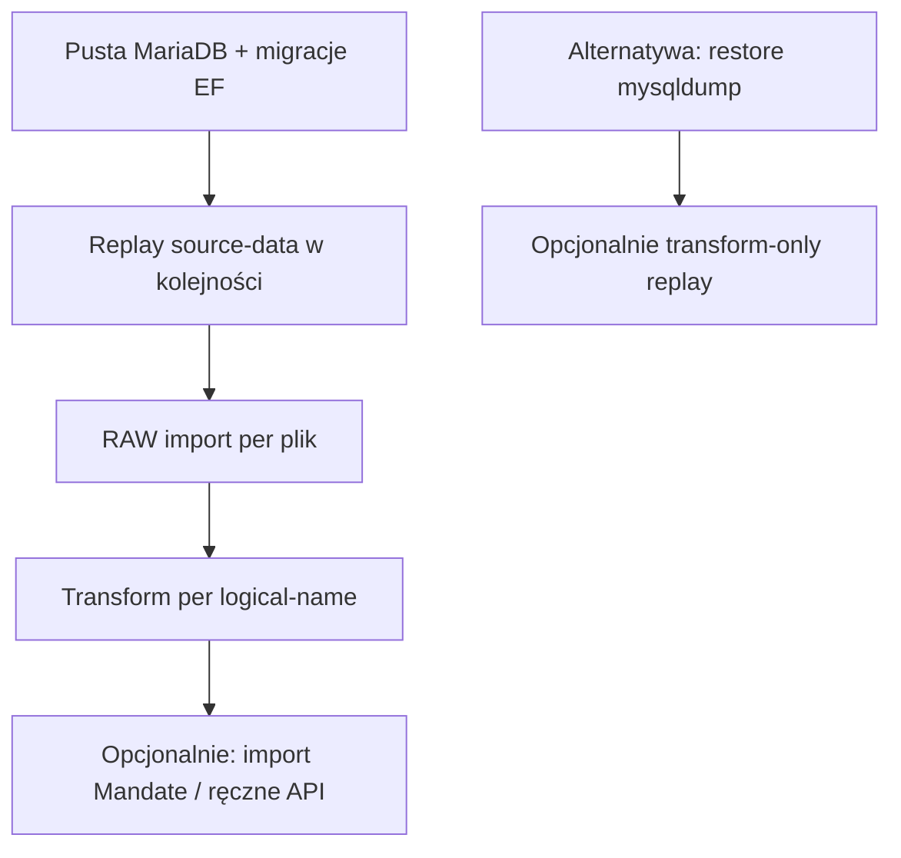

# Operacje: co pokazuje aplikacja, ręczne zdarzenia, backup, idempotency

## 1. Co aplikacja pokaże „sama” z importu Excel/PKW

| Obszar | Z samych importów wyborczych | Bez dodatkowych danych |
|--------|------------------------------|-------------------------|
| Kto **startował** w wyborach | tak (`Candidacy`) | — |
| Głosy, %, wynik listy w okręgu | tak (`CandidacyVoteResult`, `ElectoralListVoteResult`) | — |
| Kto **dostał mandat w podziale** po wyborach | częściowo (`ElectionMandateAllocation` / `Elected`) | Nie wiadomo, czy **objął** urząd |
| **Skład Sejmu w marcu 2022** | nie | wymaga `Mandate` |
| Wygaśnięcie, następca z listy, wybory uzupełniające | nie | `Mandate` + `MandateEvent` |
| Klub poselski w czasie | nie (z PKW) | `ClubMembership` + import / ręcznie |

**Wniosek:** aplikacja będzie **poprawnie** pokazywać wszystko, co wynika z zaimportowanych plików (ścieżka kariery **wyborcza**, wyniki, okręgi, listy).  
Dla **dynamicznej kadencji** (kto był posłem w dowolnym dniu) — albo dodatkowe źródła (Sejm.gov, …), albo **ręczne** (lub półautomatyczne) wpisy mandatu.

To nie jest wada modelu — tak działa rzeczywistość prawna (KW): wynik wyborów ≠ skład izby rok później.

---

## 2. Ręczne `MandateEvent` — tak, i to jest normalne

Typowe wpisy ręczne / przez API:

- wygaśnięcie mandatu (data + przyczyna art. 247),
- obsadzenie następcy z listy,
- ślubowanie (jeśli nie masz w imporcie),
- korekta historyczna,
- wybory uzupełniające (często osobny import + jedno zdarzenie).

**Endpoint admin** — rekomendowane (Faza 5–6 lub wcześniej minimalny):

| Metoda | Przykład | Cel |
|--------|----------|-----|
| `POST /api/mandates` | utworzenie `Mandate` | obsada / następca |
| `PATCH /api/mandates/{id}/terminate` | `ValidTo`, `TerminationReason` | wygaśnięcie |
| `POST /api/mandates/{id}/events` | `MandateEvent` | audyt, źródło (URL, Monitor Polski) |
| `GET /api/mandates?politicianId=&onDate=` | zapytanie „kto był posłem” | UI / GraphQL później |

Implementacja: **MediatR commands** + FluentValidation (nie logika w kontrolerze).  
Każda zmiana mandatu: opcjonalnie `TriggeredBy`, `Notes` — jak przy `ImportBatch`.

Ręczne zdarzenia **nie psują** importów — żyją obok warstwy ETL; `SourceImportRowId` może być NULL.

---

## 3. Backupy — tak, da się (warstwy)

### A. Backup bazy (obowiązkowy minimum)

MariaDB w dev/prod:

```bash
# Przykład — dump logiczny
mysqldump -u ... --single-transaction --routines politicalpaths > backup_2026-05-20.sql
```

- **Harmonogram:** cron / Task Scheduler / GitHub Actions (środowisko prod).
- **Retencja:** np. 7 daily + 4 weekly.
- **Przed dużym reimportem:** snapshot ręczny (nazwa: `pre-reimport-{batchId}`).

Docker Compose: wolumen `mariadb_data` — backup = dump SQL + opcjonalnie snapshot wolumenu.

### B. Backup „source of truth” (już masz)

- `source-data/` w Git (+ LFS) — pliki Excel **nie giną** przy odtwarzaniu DB.
- To najważniejszy backup dla **odtwarzalności badań**.

### C. Backup aplikacyjny (opcjonalnie, później)

- Eksport manifestów `ImportBatch` + checksumów.
- Nie zastępuje dumpa DB — ułatwia audyt „co było zaimportowane”.

**ADR do wdrożenia w Fazie 5:** skrypt `scripts/backup-db.ps1` + wpis w README operacyjnym.

---

## 4. Idempotency i łatwe odtwarzanie bazy

Już założone w architekturze — podsumowanie **jak z tego korzystać**.

### Poziomy idempotency

| Poziom | Klucz | Efekt ponownego uruchomienia |
|--------|-------|------------------------------|
| Plik | `Sha256` + `LogicalName` | Ten sam plik → skip RAW lub jawny `--force` |
| Wiersz RAW | `ImportRow.RowHash` | Ten sam wiersz nie duplikuje się |
| Domena | `Candidacy.SourceFingerprint`, `ElectoralList.NaturalKey`, … | Upsert — ten sam stan |
| Transform | status `ImportRow` | Replay: ustaw `Pending` → transform znowu |

### Odtworzenie bazy od zera (zalecany workflow)



1. `dotnet ef database update` — pusta struktura.
2. CLI: `import replay-all --from source-data` (docelowo) — według manifestów / roku.
3. Idempotentne upserty — **bez duplikatów** przy powtórce.
4. Ręczne `Mandate` — z osobnego eksportu JSON lub ponowne wprowadzenie (dlatego warto eksportować mandaty).

### Tryby reimportu (z [03-etl-two-stage.md](03-etl-two-stage.md))

| Tryb | Kiedy |
|------|--------|
| `SkipIfSameSha` | Produkcja — domyślnie |
| `ForceReimport` | Poprawiony transformer, ten sam plik |
| `TransformOnly` | RAW już jest, tylko nowa logika domeny |
| `NewBatchSupersedes` | Nowa wersja danych, stara historia zostaje |

### „Bardzo łatwe” odtwarzanie — co zaimplementować

| Funkcja | Priorytet |
|---------|-----------|
| `import raw` / `import transform` idempotentne | Faza 1–2 |
| `import replay-all` (kolejność z manifestu) | Faza 5 |
| `db restore --file backup.sql` (skrypt) | Faza 5 |
| Eksport/import mandatów JSON (`mandates export`) | Faza 4–6 |
| Endpoint admin mandatów | Faza 4–6 |

---

## 5. Odpowiedź w jednym akapicie

**Tak** — UI z zaimportowanych wyborów będzie spójne z danymi PKW. **Nie** — pełna kadencja w czasie bez `Mandate` / zdarzeń (importowanych lub **ręcznych przez endpoint**). Backupy: **dump MariaDB + Git `source-data`**. Odtwarzanie: **pusta DB + replay importów** (idempotency) albo **restore dump + ewentualny transform-only**.

---

## Powiązane

- [10-mandate-lifecycle.md](10-mandate-lifecycle.md)
- [03-etl-two-stage.md](03-etl-two-stage.md)
- [06-observability.md](06-observability.md)
- [implementation-plan.md](../implementation-plan.md) — Faza 5 (orkiestracja, replay)
