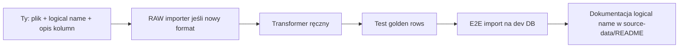

# Plan implementacji — iteracje

Plan zakłada **ręczne transformery**, **atrybut `LogicalNames`**, import wierszowy (polityk → start → szczegóły). Każda faza kończy się działającym slice’em, nie „pustym CRUD”.

---

## Faza 0 — Fundament repo (1–2 dni)

**Cel:** solution pod dokumentację, build, konwencje.

| # | Zadanie | Done when |
|---|---------|-----------|
| 0.1 | Rozdzielić solution na projekty z [07-solution-structure.md](architecture/07-solution-structure.md) | `dotnet build` OK |
| 0.2 | `source-data/README.md` + przykładowa struktura katalogów | Konwencja nazw opisana |
| 0.3 | `docker-compose` MariaDB (dev) + connection string w `appsettings.Development.json` | DB działa lokalnie |
| 0.4 | README root → link do `docs/` | — |

**Nie robić jeszcze:** GraphQL, Hangfire (opcjonalnie stub), transformery biznesowe.

---

## Faza 1 — Warstwa techniczna importu (3–5 dni)

**Cel:** można zarejestrować plik i zapisać wiersze RAW bez domeny.

| # | Zadanie | Done when |
|---|---------|-----------|
| 1.1 | Encje: `ImportBatch`, `ImportFile`, `ImportRow`, `TransformationError`, `ImportJob` | EF migracja |
| 1.2 | `AppDbContext`, schemat `app`, indeksy z [05-domain-model.md](architecture/05-domain-model.md) | Migracja applied |
| 1.3 | Serilog: log per `ImportFileId`, CorrelationId = BatchId | Plik `.log` powstaje |
| 1.4 | `RegisterImportFileCommand` — ścieżka, logical name, SHA, format version | Rekord w DB |
| 1.5 | `IRawExcelImporter` + **jeden** importer testowy (np. prosty arkusz 5 kolumn) | `ImportRow` w DB |
| 1.6 | CLI / minimal endpoint: `import raw --file ... --logical-name ...` | E2E ręczny test |

**Deliverable:** plik Excel → `ImportRow` + logi + status `ImportFile`.

---

## Faza 2 — Rejestr transformerów + pierwszy transformer (5–7 dni)

**Cel:** jeden prawdziwy (lub pół-prawdziwy) format end-to-end na domenie minimalnej.

| # | Zadanie | Done when |
|---|---------|-----------|
| 2.1 | Atrybut `ImportTransformerAttribute` + `AttributeBasedTransformerRegistry` | Kolizje wykrywane przy starcie |
| 2.2 | `IImportTransformer`, `TransformContext`, `ImportOrchestrator` (Raw → Transform) | Orkiestracja w kodzie |
| 2.3 | Domena minimalna: `Election`, `Politician`, `PoliticianAlias`, `Candidacy` | Migracja |
| 2.4 | `IPoliticianResolver` — normalizacja nazwy, tworzenie, prosty match po `NormalizedName` | Duplikaty ograniczone |
| 2.5 | **Pierwszy ręczny transformer** (wybierz jeden plik, który masz) — `TransformRowAsync` | Wiersze `Transformed` w DB |
| 2.6 | `TransformationError` + status `NeedsManualReview` | Błędny wiersz nie blokuje całego pliku |
| 2.7 | Test jednostkowy: 3–5 wierszy JSON → oczekiwane `Candidacy` | CI green |

**Deliverable:** jeden `logical-name` działa od Excela do `Candidacy`.

**Ty dostarczasz:** pierwszy plik + opis kolumn → implementacja transformera w Fazie 2.5.

---

## Faza 3 — Identity + mapowania ręczne (4–6 dni)

**Cel:** obsługa złej jakości danych i ręcznych decyzji.

| # | Zadanie | Done when |
|---|---------|-----------|
| 3.1 | `PoliticianMergeOverride` / `ManualMapping` (TERYT, okręg, polityk) | CRUD admin lub SQL seed |
| 3.2 | Identity: score, `NeedsManualReview`, opcjonalnie `IdentityMatchCandidate` | — |
| 3.3 | `IElectoralDistrictMapper` per `ElectionId` | Brak okręgu → błąd z kodem |
| 3.4 | Drugi transformer **lub** rozszerzenie `LogicalNames` na pierwszym (współdzielenie) | 2 logical names działają |
| 3.5 | Idempotency: `SourceFingerprint`, re-run transform bez duplikatów | Drugi run = 0 nowych Candidacy |

**Deliverable:** reimport i dwa formaty bez duplikowania polityków.

---

## Faza 4 — Rozszerzenie domeny (równolegle z kolejnymi plikami)

**Cel:** pełniejszy model pod analizę ścieżek (patrz [05-domain-model.md](architecture/05-domain-model.md)).

| # | Zadanie |
|---|---------|
| 4.1 | `Election`, `ElectoralDistrict` (+ `ElectoralChamber`), `ElectoralDistrictTerritory`, `ElectoralDistrictSnapshot` |
| 4.2 | `TerritorialUnit` (TERYT) + seed / mapowania ręczne |
| 4.3 | `ElectoralList` (w okręgu), `Party`, `CandidacyVoteResult`, `ElectoralListVoteResult` |
| 4.4 | `PartyAffiliation`, `ParliamentaryClub`, `ClubMembership` |
| 4.5 | **Kadencja:** `LegislativeTerm`, `ElectionMandateAllocation`, `Mandate`, `MandateEvent` ([10-mandate-lifecycle.md](architecture/10-mandate-lifecycle.md)) |
| 4.6 | Importer / UI obsady mandatu (Sejm.gov, ręcznie) — **nie** tylko z `Elected` |
| 4.7 | Kolejne transformery — **po jednym pliku na iterację** (zawsze: election → district → list → candidacy → wyniki → opcjonalnie alokacja) |

**Zasada:** każdy nowy plik = branch → transformer → test golden → merge.

---

## Faza 5 — Orkiestracja produkcyjna (3–5 dni)

| # | Zadanie |
|---|---------|
| 5.1 | Hangfire + `ImportJob`, retry Polly |
| 5.2 | Resume: `LastProcessedRowId`, batch transform |
| 5.3 | `SupersedesBatchId`, tryby reimportu |
| 5.4 | Manifest JSON w `source-data/manifest/` (opcjonalnie) |
| 5.5 | Endpoint / CLI: status batcha, lista błędów per plik |
| 5.6 | Skrypt backup MariaDB + `import replay-all` (idempotency) — patrz [11-operations-import-backup-replay.md](architecture/11-operations-import-backup-replay.md) |
| 5.7 | Admin API: `POST/PATCH` mandaty i `MandateEvent` (ręczne uzupełnienia kadencji) |

---

## Faza 6 — API analityczne (później)

| # | Zadanie |
|---|---------|
| 6.1 | MediatR queries: kariera polityka, wyniki okręgu |
| 6.2 | Hot Chocolate — tylko gdy model i import stabilne |
| 6.3 | OpenTelemetry (opcjonalnie) |

---

## Jak pracujemy iteracyjnie (proces)

### Checklist per nowy plik

- [ ] Plik w `source-data/...` z poprawną nazwą i SHA
- [ ] `logical-name` wpisany w `source-data/README.md`
- [ ] `[ImportTransformer(LogicalNames = ["..."])]` na klasie
- [ ] RAW importer (jeśli inny układ arkusza niż istniejące)
- [ ] Test jednostkowy wierszy
- [ ] Jedno E2E na żywej bazie

---

## Proponowana kolejność „Ty + agent”

| Iteracja | Ty | Implementacja |
|----------|-----|----------------|
| **1** | Zatwierdź strukturę solution | Faza 0 + 1 |
| **2** | Pierwszy plik Excel + nazwa logiczna + opis kolumn | Faza 2 (pierwszy transformer) |
| **3** | Drugi plik podobny lub inny | Faza 3 + współdzielenie atrybutu |
| **4** | Kolejne pliki (partia) | Faza 4 — jeden plik na raz |
| **5** | Wymagania schedulera | Faza 5 |

---

## Otwarte punkty (do uzupełnienia)

- [ ] Schemat ERD z `Bez tytulu.jpg` — doprecyzowanie FK w Fazie 4
- [ ] Lista `logical-name` dla wszystkich planowanych plików
- [ ] Polityka: czy `Failed` wiersze blokują status `Completed` pliku → `PartiallyCompleted`

---

## Następny krok

**Iteracja 1:** Faza 0 + 1 (solution + encje importu + RAW bez transformacji domenowej).

Po Twoim „ok” — generujemy szkielet projektów i pierwszą migrację EF.
